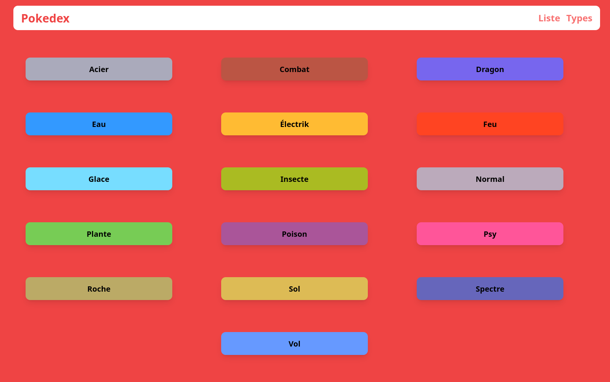
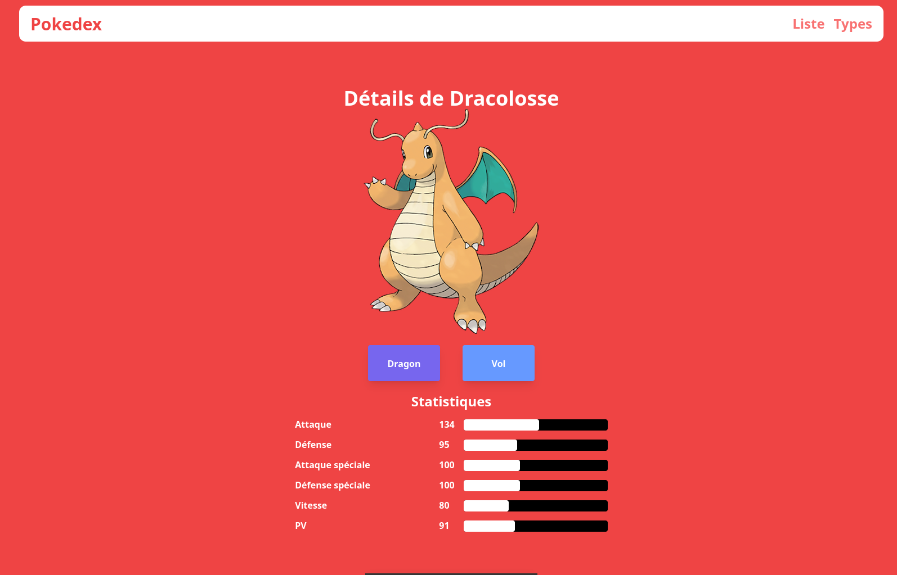

# PokedexApp
C'est un site permettant de retrouver tous les pokemondes de la 1ière génération
Il est fait en PHP natif avec un MVC.

# Faire fonctionner le site
Tous d'abord, après avoir récupérer le repo, il vous faudra faire un composer update et install dans le dossier PokeApp.
Ensuite, il vous faut lancer xampp et importer le fichier pokedex.SQL dans phpmyadmin
Ensuite, dans le fichier htdocs de xampp vous pouvez copier le dossier PokeApp.
Vous n'avez plus qu'a aller sur votre localhost/PokeApp/public !

# Captures d'écran du site 
# Page Home

# Page type

# Page Détail

